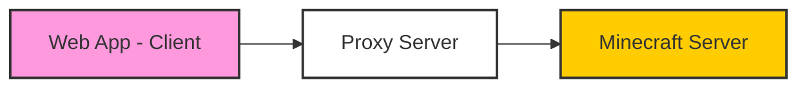

# Minecraft Web Client


Minecraft **clone** rewritten in TypeScript using the best modern web technologies. Minecraft vanilla-compatible client and integrated server packaged into a single web app.

You can try this out at [mcraft.fun](https://mcraft.fun/), [pcm.gg](https://pcm.gg) (short link), [mcon.vercel.app](https://mcon.vercel.app/) or the GitHub pages deploy. Every commit from the default (`develop`) branch is deployed to [s.mcraft.fun](https://s.mcraft.fun/) and [s.pcm.gg](https://s.pcm.gg/) - so it's usually newer, but might be less stable.

Don't confuse with [Eaglercraft](https://git.eaglercraft.rip/eaglercraft/eaglercraft-1.8) which is a REAL vanilla Minecraft Java edition port to the web (but with its own limitations). Eaglercraft is a fully playable solution, but this project is more in position of a "technical demo" to show how it's possible to build games for web at scale entirely with the JS ecosystem. Have fun!

For building the project yourself / contributing, see [Development, Debugging & Contributing](#development-debugging--contributing). For reference at what and how web technologies / frameworks are used, see [TECH.md](./TECH.md).

### Big Features

- Open any zip world file or even folder in read-write mode!
- Connect to Java servers running in both offline (cracked) and online mode* (it's possible because of proxy servers, see below)
- Integrated JS server capable of opening Java world saves in any way (folders, zip, web streaming, etc)
- Singleplayer mode with simple world generations!
- Works offline
- First-class touch (mobile) & controller support
- First-class keybindings configuration
- Basic Resource pack support: Custom GUI, all textures. Server resource packs are not supported yet.
- Builtin JEI with recipes & descriptions for every item (JEI is creative inventory replacement)
- Play with friends over internet! (P2P is powered by Peer.js discovery servers)
- ~~Google Drive support for reading / saving worlds back to the cloud~~
- even even more!

All components that are in [Storybook](https://mcraft.fun/storybook) are published as npm module and can be used in other projects: [`minecraft-react`](https://npmjs.com/minecraft-react)

### Recommended Settings

- Controls -> **Touch Controls Type** -> **Joystick**
- Controls -> **Auto Full Screen** -> **On** - To avoid ctrl+w issue
- Controls -> **Raw Input** -> **On** - This will make the controls more precise (UPD: already enabled by default)
- Interface -> **Chat Select** -> **On** - To select chat messages (UPD: already enabled by default)

### World Loading

Zip files and folders are supported. Just drag and drop them into the browser window. You can open folders in readonly and read-write mode. New chunks may be generated incorrectly for now.
In case of opening zip files they are stored in your ram entirely, so there is a ~300mb file limit on IOS.
Whatever offline mode you used (zip, folder, just single player), you can always export world with the `/export` command typed in the game chat.


### Servers & Proxy

You can play almost on any Java server, vanilla servers are fully supported.
See the [Mineflayer](https://github.com/PrismarineJS/mineflayer) repo for the list of supported versions (should support majority of versions).
There is a builtin proxy, but you can also host your one! Just clone the repo, run `pnpm i` (following CONTRIBUTING.MD) and run `pnpm prod-start`, then you can specify `http://localhost:8080` in the proxy field. Or you can deploy it to the cloud service:

[](https://app.koyeb.com/deploy?name=minecraft-web-client&type=git&repository=zardoy%2Fminecraft-web-client&branch=next&builder=dockerfile&env%5B%5D=&ports=8080%3Bhttp%3B%2F)

Proxy servers are used to connect to Minecraft servers which use TCP protocol. When you connect connect to a server with a proxy, websocket connection is created between you (browser client) and the proxy server located in Europe, then the proxy connects to the Minecraft server and sends the data to the client (you) without any packet deserialization to avoid any additional delays. That said all the Minecraft protocol packets are processed by the client, right in your browser.



So if the server is located in Europe and you are connecting from Europe, you will have ~40ms ping (~180ms with residential proxy version), however if you are in the US and connecting to the server located in US, you will have >200ms ping, which is the worst case scenario.

Again, the proxy server is not a part of the client, it is a separate service that you can host yourself.

### Docker Files

- [Main Dockerfile](./Dockerfile) - for production build & offline/private usage. Includes full web-app + proxy server for connecting to Minecraft servers.
- [Proxy Dockerfile](./Dockerfile.proxy) - for proxy server only - that one you would be able to specify in the proxy field on the client (`docker build . -f Dockerfile.proxy -t minecraft-web-proxy`)

In case of using docker, you don't have to follow preparation steps from CONTRIBUTING.MD, like installing Node.js, pnpm, etc.

### Rendering

#### Three.js Renderer

- Uses WebGL2. Chunks are rendered using Geometry Buffers prepared by 4 mesher workers.
- Entities & text rendering
- Supports resource packs
- Doesn't support occlusion culling

### Advanced Settings

There are many many settings, that are not exposed in the UI yet. You can find or change them by opening the browser console and typing `options`. You can also change them by typing `options.<setting_name> = <value>`.

### Console

To open the console, press `F12`, or if you are on mobile, you can type `#dev` in the URL (browser address bar), it wont't reload the page, but you will see a button to open the console. This way you can change advanced settings and see all errors or warnings. Also this way you can access global variables (described below).

### Development, Debugging & Contributing

It should be easy to build/start the project locally. See [CONTRIBUTING.MD](./CONTRIBUTING.md) for more info. Also you can look at Dockerfile for reference.

There is world renderer playground ([link](https://mcon.vercel.app/playground/)).

However, there are many things that can be done in online production version (like debugging actual source code). Also you can access some global variables in the console and there are a few useful examples:

- `localStorage.debug = '*'` - Enables all debug messages! Warning: this will start all packets spam.
Instead I recommend setting `options.debugLogNotFrequentPackets`. Also you can use `debugTopPackets` (with JSON.stringify) to see what packets were received/sent by name

- `bot` - Mineflayer bot instance. See Mineflayer documentation for more.
- `viewer` - Three.js viewer instance, basically does all the rendering.
- `viewer.world.sectionObjects` - Object with all active chunk sections (geometries) in the world. Each chunk section is a Three.js mesh or group.
- `debugSceneChunks` - The same as above, but relative to current bot position (e.g. 0,0 is the current chunk).
- `debugChangedOptions` - See what options are changed. Don't change options here.
- `localServer`/`server` - Only for singleplayer mode/host. Flying Squid server instance, see it's documentation for more.
- `localServer.overworld.storageProvider.regions` - See ALL LOADED region files with all raw data.
- `localServer.levelData.LevelName = 'test'; localServer.writeLevelDat()` - Change name of the world

- `nbt.simplify(someNbt)` - Simplifies nbt data, so it's easier to read.

The most useful thing in devtools is the watch expression. You can add any expression there and it will be re-evaluated in real time. For example, you can add `viewer.camera.position` to see the camera position and so on.


You can also drag and drop any .dat or .mca (region files) into the browser window to see it's contents in the console.

### F3 Keybindings

- `F3` - Toggle debug overlay
- `F3 + A` - Reload all chunks (these that are loaded from the server)
<!-- <!-- - `F3 + N` - Restart local server (basically resets the world!) -->
- `F3 + G` - Toggle chunk sections (geometries) border visibility + entities outline (aka Three.js geometry helpers)

world chunks have a *yellow* border, hostile mobs have a *red* outline, passive mobs have a *green* outline, players have a *blue* outline.

### Query Parameters

Press `Y` to set query parameters to url of your current game state.

There are some parameters you can set in the url to archive some specific behaviors:

General:

- **`?setting=<setting_name>:<setting_value>`** - Set and lock the setting on load. You can set multiple settings by separating them with `&` e.g. `?setting=autoParkour:true&setting=renderDistance:4`
- `?modal=<modal>` - Open specific modal on page load eg `keybindings`. Very useful on UI changes testing during dev. For path use `,` as separator. To get currently opened modal type this in the console: `activeModalStack.at(-1).reactType`

Server specific:

- `?ip=<server_address>` - Display connect screen to the server on load with predefined server ip. `:<port>` is optional and can be added to the ip.
- `?name=<name>` - Set the server name for saving to the server list
- `?version=<version>` - Set the version for the server
- `?proxy=<proxy_address>` - Set the proxy server address to use for  the server
- `?username=<username>` - Set the username for the server
- `?lockConnect=true` - Only works then `ip` parameter is set. Disables cancel/save buttons and all inputs in the connect screen already set as parameters. Useful for integrates iframes.
- `?serversList=<list_or_url>` - `<list_or_url>` can be a list of servers in the format `ip:version,ip` or a url to a json file with the same format (array) or a txt file with line-delimited list of server IPs.

Single player specific:

- `?loadSave=<save_name>` - Load the save on load with the specified folder name (not title)
- `?singleplayer=1` or `?sp=1` - Create empty world on load. Nothing will be saved
- `?version=<version>` - Set the version for the singleplayer world (when used with `?singleplayer=1`)
- `?noSave=true` - Disable auto save on unload / disconnect / export whenever a world is loaded. Only manual save with `/save` command will work.
- `?serverSetting=<key>:<value>` - Set local server [options](https://github.com/zardoy/space-squid/tree/everything/src/modules.ts#L51). For example `?serverSetting=noInitialChunksSend:true` will disable initial chunks loading on the loading screen.
- `?map=<map_url>` - Load the map from ZIP. You can use any url, but it must be **CORS enabled**.
- `?mapDir=<index_file_url>` - Load the map from a file descriptor. It's recommended and the fastest way to load world but requires additional setup. The file must be in the following format:

```json
{
    "baseUrl": "<url>",
    "index": {
        "level.dat": null,
        "region": {
            "r.-1.-1.mca": null,
            "r.-1.0.mca": null,
            "r.0.-1.mca": null,
            "r.0.0.mca": null,
        }
    }
}
```

Note that `mapDir` also accepts base64 encoded JSON like so:
`?mapDir=data:application/json;base64,...` where `...` is the base64 encoded JSON of the index file.
In this case you must use `?mapDirBaseUrl` to specify the base URL to fetch the files from index.

- `?mapDirBaseUrl` - See above.

Only during development:

- `?reconnect=true` - Reconnect to the server on page reloads. Very useful on server testing.

<!-- - `?mapDirGuess=<base_url>` - Load the map from the provided URL and paths will be guessed with a few additional fetch requests. -->

### Notable Things that Power this Project

- [Mineflayer](https://github.com/PrismarineJS/mineflayer) - Handles all client-side communications with the server (including the builtin one) - forked
- [Forked Flying Squid (Space Squid)](https://github.com/zardoy/space-squid) - The builtin offline server that makes single player & P2P possible!
- [Prismarine Provider Anvil](https://github.com/PrismarineJS/prismarine-provider-anvil) - Handles world loading (region format)
- [Prismarine Physics](https://github.com/PrismarineJS/prismarine-physics) - Does all the physics calculations
- [Minecraft Protocol](https://github.com/PrismarineJS/node-minecraft-protocol) - Makes connections to servers possible
- [Peer.js](https://peerjs.com/) - P2P networking (when you open to wan)
- [Three.js](https://threejs.org/) - Helping in 3D rendering

### Things that are not planned yet

- Mods, plugins (basically JARs) support, shaders - since they all are related to specific game pipelines

### Alternatives

- [https://github.com/ClassiCube/ClassiCube](ClassiCube - Better C# Rewrite) [DEMO](https://www.classicube.net/server/play/?warned=true)
- [https://m.eaglercraft.com/](EaglerCraft) - Eaglercraft runnable on mobile (real Minecraft in the browser)
