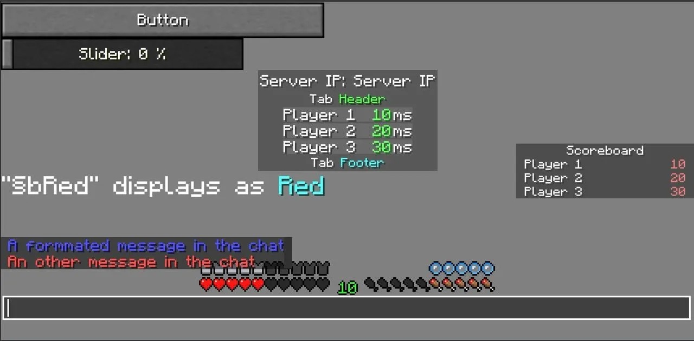

# Minecraft React

Minecraft UI components for React extracted from [mcraft.fun](https://mcraft.fun) project.

```bash
pnpm i minecraft-react
```



## Usage

```jsx
import { Scoreboard } from 'minecraft-react'

const App = () => {
  return (
    <Scoreboard
      open
      title="Scoreboard"
      items={[
        { name: 'Player 1', value: 10 },
        { name: 'Player 2', value: 20 },
        { name: 'Player 3', value: 30 },
      ]}
    />
  )
}
```

See [Storybook](https://mcraft.fun/storybook/) or [Storybook (Mirror link)](https://mcon.vercel.app/storybook/) for more examples and full components list. Also take a look at the full [standalone example](https://github.com/zardoy/minecraft-web-client/tree/experiments/UiStandaloneExample.tsx).

There are two types of components:

- Small UI components or HUD components
- Full screen components (like sign editor, worlds selector)
